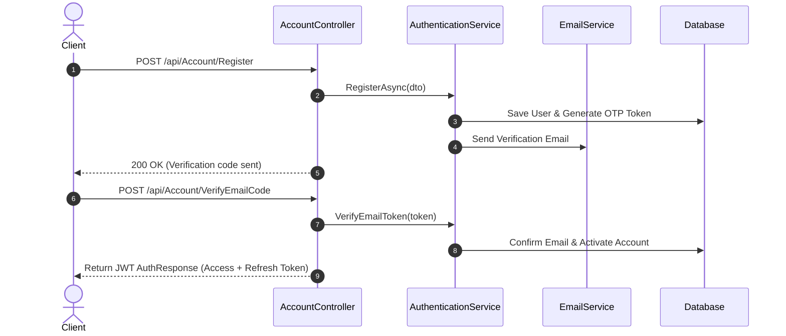
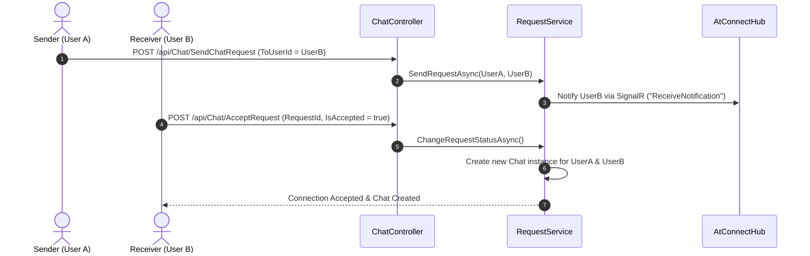
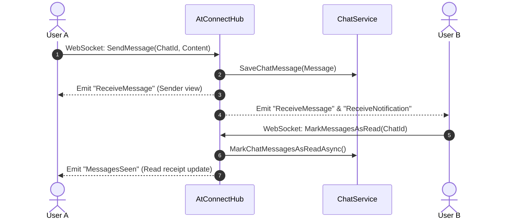

# 🌐 AtConnect — Real-Time Chat & Connection Management Backend

[](https://dotnet.microsoft.com/)


**AtConnect** is a robust, scalable, real-time connection and messaging backend built with ASP.NET Core following **Clean N-Tier Architecture**. It powers modern real-time mobile and web communication platforms by handling identity management, mutual connection requests, real-time messaging, typing indicators, read receipts, user presence tracking, and dynamic notifications.

---

## 📌 Table of Contents

- [Overview](#-overview)
- [Key Features](#-key-features)
- [Architecture](#-architecture)
- [Main Workflows](#-main-workflows)
- [Tech Stack](#-tech-stack)
- [API & SignalR Reference](#-api--signalr-reference)
- [Getting Started](#-getting-started)
- [License](#-license)

---

## 🚀 Overview

**AtConnect** is designed to solve real-time user-to-user interaction and networking requirements for mobile (e.g., Flutter, React Native) and web clients. Rather than allowing unrestricted direct messaging, AtConnect enforces a **Connection Request Flow**—users connect via mutual request acceptance before establishing a dedicated real-time chat channel.

### Highlights:
- **Clean Architecture**: Decoupled domain models, persistence, business logic, and presentation layers.
- **WebSocket-First Messaging**: Powered by ASP.NET Core SignalR with fallback mechanisms.
- **Presence & Connection Tracking**: Multi-device connection tracking for online/offline status and "Last Seen" updates.
- **Enterprise Security**: JWT authentication with refresh tokens, query-string bearer token handling for WebSockets, and global error handling middleware.

---

## ✨ Key Features

### 🔐 Authentication & Identity Management
- **Secure Registration & Login**: Email and password authentication with ASP.NET Core Identity.
- **Email Verification & Password Reset**: Automated SMTP email delivery with OTP/token validation.
- **JWT & Refresh Tokens**: Stateful refresh tokens stored securely for session management.
- **User Profile Management**: Update user avatar, bio, full name, and personal details.

### 🤝 Connection & Request Management
- **User Discovery**: Search and list users with paginated queries.
- **Chat Requests**: Send, accept, or reject chat requests between users.
- **Permission Boundaries**: Users can only message each other after a connection request is accepted.

### 💬 Real-Time Chat & Messaging (SignalR)
- **Instant One-on-One Messaging**: Low-latency WebSocket message delivery.
- **Typing Indicators**: Real-time event broadcasts when a user is typing.
- **Read Receipts (`MessagesSeen`)**: Automatic and manual tracking of message read status.
- **Message History**: Paginated fetching of historical messages.

### 🔔 Presence & Notification System
- **Real-time & Persisted Notifications**: Push real-time alerts via SignalR when receiving new messages or request status updates.
- **User Presence Tracking**: Tracks active WebSocket connections per user ID; automatically marks users as `Online` or `Offline` with updated `LastSeen` timestamp.

---

## 🏗️ Architecture

AtConnect is built using **Clean N-Tier Architecture** principles to achieve separation of concerns, testability, and maintainability.

```
                  ┌─────────────────────────────────────────┐
                  │              AtConnect.Api              │
                  │   (Controllers, SignalR Hubs, Middlewares) │
                  └────────────────────┬────────────────────┘
                                       │
                                       ▼
                  ┌─────────────────────────────────────────┐
                  │              AtConnect.BLL              │
                  │     (Services, DTOs, Helpers, Options)  │
                  └────────────────────┬────────────────────┘
                                       │
                                       ▼
                  ┌─────────────────────────────────────────┐
                  │              AtConnect.Core             │
                  │ (Domain Models, Interfaces, Enums, DTOs) │
                  └────────────────────▲────────────────────┘
                                       │
                  ┌────────────────────┴────────────────────┐
                  │              AtConnect.DAL              │
                  │ (EF Core AppDbContext, Repositories, UoW)│
                  └─────────────────────────────────────────┘
```

### Layer Responsibilities

| Project / Layer | Primary Responsibility |
| :--- | :--- |
| **`AtConnect.Core`** | Core Domain entities (`AppUser`, `Chat`, `Message`, `Notification`, `ChatRequest`), custom enums, shared DTOs, and interface definitions (`IUnitOfWork`, `IGenericRepository`, `INotifier`). |
| **`AtConnect.DAL`** | Data access implementation utilizing Entity Framework Core, SQL Server / PostgreSQL provider, Repository implementations, migrations, and database seed configurations. |
| **`AtConnect.BLL`** | Application business logic, domain services (`AuthenticationService`, `ChatService`, `RequestService`, `UserService`, `NotificationService`, `EmailService`), and mapping helpers. |
| **`AtConnect.Api`** | RESTful Controllers, SignalR Hub (`AtConnectHub`), JWT bearer authentication configuration, CORS policies, and custom exception handling middleware. |

---

## 🔄 Main Workflows

### 1. Authentication & Onboarding


### 2. Connection Request & Chat Setup


### 3. Real-Time Messaging & Read Receipts


---

## 🛠️ Tech Stack

- **Framework**: .NET 8 (C# 12)
- **Web API & WebSockets**: ASP.NET Core Web API, SignalR Core
- **Database & ORM**: Entity Framework Core 8, SQL Server / PostgreSQL
- **Security & Authentication**: ASP.NET Core Identity, JWT (JSON Web Tokens), BCrypt Password Hashing
- **Mailing**: System.Net.Mail / MailKit with SMTP
- **API Documentation**: Swagger / OpenAPI (Swashbuckle)
---

## 📡 API & SignalR Reference

### REST Endpoints Summary

#### 🔑 Account (`/api/Account`)
- `POST /Login` — Authenticate and retrieve access/refresh tokens.
- `POST /Register` — Register new user account.
- `POST /VerifyEmailCode` — Confirm email address via OTP.
- `POST /ForgotPassword` & `/ResetPassword` — Password recovery workflow.
- `POST /RefreshToken` — Obtain new access token via refresh token.

#### 💬 Chat (`/api/Chat`)
- `GET /UserChats` — Paginated list of active user chats.
- `GET /ChatRequests` — List pending connection requests.
- `POST /SendChatRequest` — Send connection request to another user.
- `POST /AcceptRequest` — Accept or reject a connection request.
- `GET /ChatMessages` — Paginated chat history for a specific chat.
- `GET /{chatId}` — Retrieve single chat metadata.

#### 👤 User (`/api/User`)
- `GET /AllUsers` — Search/List registered users (paginated).
- `GET /UserProfile` — Fetch detailed user profile.
- `PUT /EditProfile` — Update bio, avatar, and personal details.

#### 🔔 Notifications (`/api/Notifications`)
- `GET /` — List user notifications (paginated).
- `GET /unread` — List unread notifications.
- `POST /read-all` — Mark all notifications as read.

---

### SignalR WebSocket Events (`/Hubs/AtConnect`)

#### Client to Server Methods:
- `SendTyping(chatId)` — Broadcasts typing state to opponent.
- `SendMessage(msgRequest)` — Persists and broadcasts message to participants.
- `MarkMessagesAsRead(chatId)` — Marks unread messages as read and emits `MessagesSeen`.

#### Server to Client Listeners:
- `ReceiveMessage` — Listens for new incoming messages.
- `ReceiveNotification` — Listens for real-time notification alerts.
- `ReceiveTyping` — Listens for opponent typing events.
- `MessagesSeen` — Listens for read receipt confirmations.

---

## ⚙️ Getting Started

### Prerequisites
- [.NET 8.0 SDK](https://dotnet.microsoft.com/download) or higher (.NET 10 supported).
- [SQL Server](https://www.microsoft.com/sql-server) or [PostgreSQL](https://www.postgresql.org/).
- Git client.

### Setup Steps

1. **Clone the repository**:
   ```bash
   git clone https://github.com/Mohamed-ALQarram/AtConnect.git
   cd AtConnect
   ```

2. **Configure Application Settings**:
   Update `AtConnect/appsettings.json` or `appsettings.Development.json`:
   ```json
   {
     "ConnectionStrings": {
       "AtConnectPostgresConnection": "Host=localhost;Database=AtConnectDb;Username=postgres;Password=yourpassword",
       "AtConnectSqlServerConnection": "Server=localhost;Database=AtConnectDb;Trusted_Connection=True;TrustServerCertificate=True;"
     },
     "AtConnect": {
       "Jwt": {
         "Issuer": "https://localhost:7217",
         "Audience": "https://localhost:7217",
         "LifeTime": "00:30:00",
         "SigningKey": "SUPER_SECRET_STRONG_KEY_ATCONNECT_2026!"
       },
       "Smtp": {
         "Host": "smtp.gmail.com",
         "Port": 587,
         "Email": "your-email@gmail.com",
         "Password": "your-app-password"
       }
     }
   }
   ```

3. **Database Migration**:
   Apply Entity Framework Core migrations to construct the database schema:
   ```bash
   dotnet ef database update --project AtConnect.DAL --startup-project AtConnect
   ```

4. **Restore & Build**:
   ```bash
   dotnet restore
   dotnet build
   ```

5. **Run the API**:
   ```bash
   dotnet run --project AtConnect
   ```

6. **Access Swagger UI**:
   Open browser at: [https://localhost:7217/swagger](https://localhost:7217/swagger)

---

## 📄 License

This project is licensed under the MIT License - see the [LICENSE](LICENSE) file for details.
