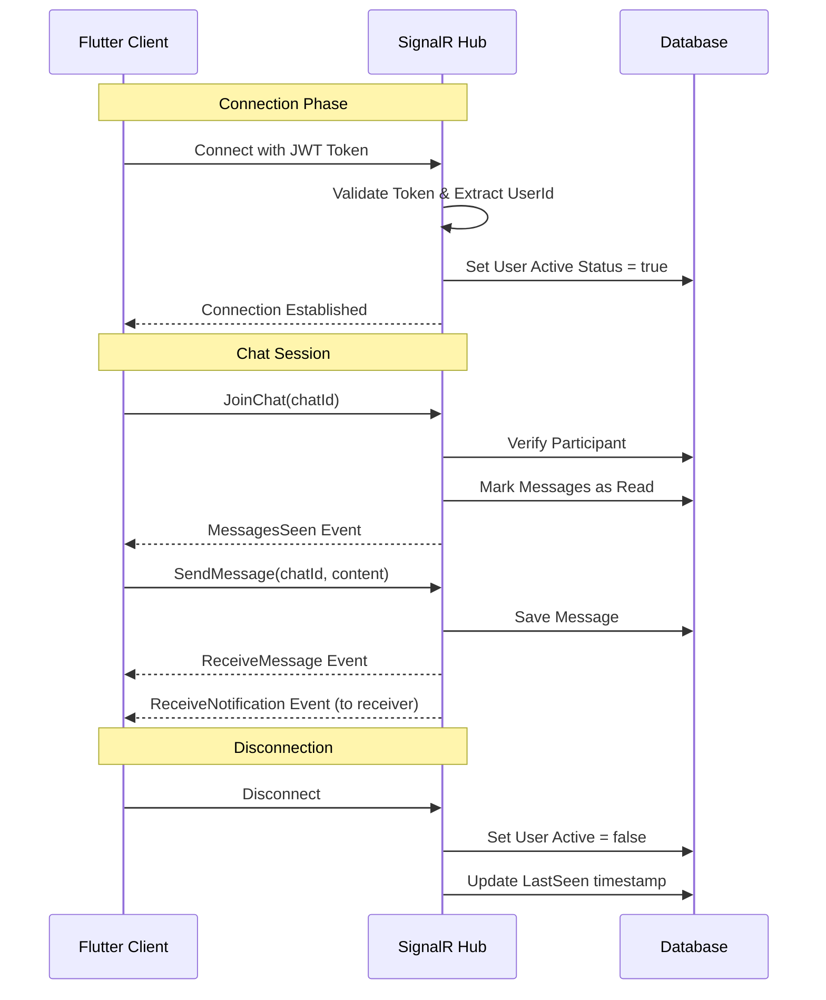

# AtConnect SignalR Integration Guide for Flutter

This document provides comprehensive documentation for integrating the AtConnect SignalR Hub with a Flutter client application.

---

## Table of Contents

1. [Connection Setup](#connection-setup)
2. [Authentication](#authentication)
3. [Hub Methods (Client → Server)](#hub-methods-client--server)
4. [Events (Server → Client)](#events-server--client)
5. [Data Models](#data-models)
6. [Flutter Implementation Example](#flutter-implementation-example)
7. [Connection Lifecycle](#connection-lifecycle)
8. [Error Handling](#error-handling)

---

## Connection Setup

### Hub Endpoint

```
wss://<your-server-domain>/Hubs/AtConnect
```

### Required Package

For Flutter, use the `signalr_netcore` package:

```yaml
dependencies:
  signalr_netcore: ^1.3.7
```

---

## Authentication

The SignalR hub requires **JWT Bearer Token** authentication. The token must be passed during connection establishment.

### Connection with Token

```dart
final hubConnection = HubConnectionBuilder()
    .withUrl(
      'https://<your-server>/Hubs/AtConnect',
      options: HttpConnectionOptions(
        accessTokenFactory: () async => await getAccessToken(),
        transport: HttpTransportType.webSockets,
      ),
    )
    .withAutomaticReconnect()
    .build();
```

> [!IMPORTANT]
> The user must be authenticated before connecting to the hub. The server extracts the user ID from the JWT token's `sub` or `nameidentifier` claim.

---

## Hub Methods (Client → Server)

These are the methods your Flutter client can invoke on the server.

### 1. `JoinChat`

Join a specific chat room to receive real-time messages.

| Parameter | Type | Description |
|-----------|------|-------------|
| `chatId` | `int` | The ID of the chat to join |

**Behavior:**
- Adds the connection to the chat's SignalR group
- Automatically marks all unread messages in the chat as "seen"
- Broadcasts `MessagesSeen` event to all participants if any messages were marked as read

**Example:**
```dart
await hubConnection.invoke('JoinChat', args: [chatId]);
```

**Errors:**
- `HubException: Not allowed to join this chat.` - User is not a participant of this chat

---

### 2. `SendMessage`

Send a message to a chat room.

| Parameter | Type | Description |
|-----------|------|-------------|
| `msgRequest` | `SendMessageRequest` | Object containing chatId and content |

**Request Object:**
```json
{
  "chatId": 123,
  "content": "Hello, World!"
}
```

**Behavior:**
- Saves the message to the database
- Broadcasts `ReceiveMessage` event to all chat participants
- Creates a notification for the receiver
- Sends `ReceiveNotification` event to the receiver

**Example:**
```dart
await hubConnection.invoke('SendMessage', args: [
  {'chatId': chatId, 'content': messageText}
]);
```

**Errors:**
- `HubException: Not allowed to send messages in this chat.` - User is not a participant

---

### 3. `SendTyping`

Notify other participants that the user is typing.

| Parameter | Type | Description |
|-----------|------|-------------|
| `chatId` | `int` | The ID of the chat where user is typing |

**Behavior:**
- Broadcasts `ReceiveTyping` event to all other participants in the chat group

**Example:**
```dart
await hubConnection.invoke('SendTyping', args: [chatId]);
```

---

### 4. `MarkMessagesAsRead`

Mark all messages in a chat as read.

| Parameter | Type | Description |
|-----------|------|-------------|
| `chatId` | `int` | The ID of the chat to mark as read |

**Behavior:**
- Marks all unread messages (from the other participant) as "seen"
- Broadcasts `MessagesSeen` event to all participants if any messages were updated

**Example:**
```dart
await hubConnection.invoke('MarkMessagesAsRead', args: [chatId]);
```

---

## Events (Server → Client)

These are the events your Flutter client should listen for.

### 1. `ReceiveMessage`

Triggered when a new message is sent in a chat you've joined.

**Payload:**
```json
{
  "messageId": 456,
  "senderId": 1,
  "chatId": 123,
  "content": "Hello, World!",
  "sentAt": "2024-12-16T15:30:00Z"
}
```

**Example Handler:**
```dart
hubConnection.on('ReceiveMessage', (arguments) {
  final message = arguments?[0] as Map<String, dynamic>;
  print('New message: ${message['content']}');
});
```

---

### 2. `ReceiveTyping`

Triggered when another user is typing in a chat.

**Payload:**
```json
{
  "userId": 2,
  "chatId": 123
}
```

**Example Handler:**
```dart
hubConnection.on('ReceiveTyping', (arguments) {
  final data = arguments?[0] as Map<String, dynamic>;
  print('User ${data['userId']} is typing in chat ${data['chatId']}');
});
```

---

### 3. `MessagesSeen`

Triggered when messages are marked as read.

**Payload:**
```json
{
  "chatId": 123,
  "readerId": 2,
  "readAt": "2024-12-16T15:35:00Z"
}
```

**Example Handler:**
```dart
hubConnection.on('MessagesSeen', (arguments) {
  final data = arguments?[0] as Map<String, dynamic>;
  print('Messages in chat ${data['chatId']} were read by user ${data['readerId']}');
});
```

---

### 4. `ReceiveNotification`

Triggered when a notification is sent to the user (e.g., new message, chat request).

**Payload:**
```json
{
  "id": 789,
  "userId": 1,
  "chatId": 123,
  "chatRequestId": null,
  "message": "Hello, World!",
  "type": 0,
  "createdAt": "2024-12-16T15:30:00Z",
  "isRead": false
}
```

**Notification Types:**
| Value | Name | Description |
|-------|------|-------------|
| 0 | `NewMessage` | User received a new chat message |
| 1 | `ChatRequestReceived` | Someone sent you a chat request |
| 2 | `ChatRequestAccepted` | Your chat request was accepted |
| 3 | `ChatRequestRejected` | Your chat request was rejected |

**Example Handler:**
```dart
hubConnection.on('ReceiveNotification', (arguments) {
  final notification = arguments?[0] as Map<String, dynamic>;
  handleNotification(notification);
});
```

---

## Data Models

### Dart Models

```dart
// Send Message Request
class SendMessageRequest {
  final int chatId;
  final String content;

  SendMessageRequest({required this.chatId, required this.content});

  Map<String, dynamic> toJson() => {
    'chatId': chatId,
    'content': content,
  };
}

// Received Message
class ReceivedMessage {
  final int messageId;
  final int senderId;
  final int chatId;
  final String content;
  final DateTime sentAt;

  ReceivedMessage({
    required this.messageId,
    required this.senderId,
    required this.chatId,
    required this.content,
    required this.sentAt,
  });

  factory ReceivedMessage.fromJson(Map<String, dynamic> json) {
    return ReceivedMessage(
      messageId: json['messageId'],
      senderId: json['senderId'],
      chatId: json['chatId'],
      content: json['content'],
      sentAt: DateTime.parse(json['sentAt']),
    );
  }
}

// Message Status Enum
enum MessageStatus {
  sent,      // 0
  delivered, // 1
  seen,      // 2
}

// Notification Type Enum
enum NotificationType {
  newMessage,            // 0
  chatRequestReceived,   // 1
  chatRequestAccepted,   // 2
  chatRequestRejected,   // 3
}

// Notification Model
class Notification {
  final int id;
  final int userId;
  final int? chatId;
  final int? chatRequestId;
  final String message;
  final NotificationType type;
  final DateTime createdAt;
  final bool isRead;

  Notification({
    required this.id,
    required this.userId,
    this.chatId,
    this.chatRequestId,
    required this.message,
    required this.type,
    required this.createdAt,
    required this.isRead,
  });

  factory Notification.fromJson(Map<String, dynamic> json) {
    return Notification(
      id: json['id'],
      userId: json['userId'],
      chatId: json['chatId'],
      chatRequestId: json['chatRequestId'],
      message: json['message'],
      type: NotificationType.values[json['type']],
      createdAt: DateTime.parse(json['createdAt']),
      isRead: json['isRead'],
    );
  }
}

// Messages Seen Event
class MessagesSeenEvent {
  final int chatId;
  final int readerId;
  final DateTime readAt;

  MessagesSeenEvent({
    required this.chatId,
    required this.readerId,
    required this.readAt,
  });

  factory MessagesSeenEvent.fromJson(Map<String, dynamic> json) {
    return MessagesSeenEvent(
      chatId: json['chatId'],
      readerId: json['readerId'],
      readAt: DateTime.parse(json['readAt']),
    );
  }
}

// Typing Event
class TypingEvent {
  final int userId;
  final int chatId;

  TypingEvent({required this.userId, required this.chatId});

  factory TypingEvent.fromJson(Map<String, dynamic> json) {
    return TypingEvent(
      userId: json['userId'],
      chatId: json['chatId'],
    );
  }
}
```

---

## Flutter Implementation Example

### Complete SignalR Service

```dart
import 'package:signalr_netcore/signalr_client.dart';

class SignalRService {
  late HubConnection _hubConnection;
  final String _hubUrl;
  final Future<String> Function() _getAccessToken;
  
  // Callbacks
  Function(ReceivedMessage)? onMessageReceived;
  Function(TypingEvent)? onTypingReceived;
  Function(MessagesSeenEvent)? onMessagesSeen;
  Function(Notification)? onNotificationReceived;
  Function()? onConnected;
  Function()? onDisconnected;

  SignalRService({
    required String hubUrl,
    required Future<String> Function() getAccessToken,
  })  : _hubUrl = hubUrl,
        _getAccessToken = getAccessToken;

  Future<void> initialize() async {
    _hubConnection = HubConnectionBuilder()
        .withUrl(
          _hubUrl,
          options: HttpConnectionOptions(
            accessTokenFactory: _getAccessToken,
            transport: HttpTransportType.webSockets,
            skipNegotiation: true,
          ),
        )
        .withAutomaticReconnect()
        .build();

    _registerEventHandlers();
  }

  void _registerEventHandlers() {
    _hubConnection.on('ReceiveMessage', (args) {
      if (args != null && args.isNotEmpty) {
        final message = ReceivedMessage.fromJson(
          Map<String, dynamic>.from(args[0] as Map),
        );
        onMessageReceived?.call(message);
      }
    });

    _hubConnection.on('ReceiveTyping', (args) {
      if (args != null && args.isNotEmpty) {
        final typing = TypingEvent.fromJson(
          Map<String, dynamic>.from(args[0] as Map),
        );
        onTypingReceived?.call(typing);
      }
    });

    _hubConnection.on('MessagesSeen', (args) {
      if (args != null && args.isNotEmpty) {
        final seen = MessagesSeenEvent.fromJson(
          Map<String, dynamic>.from(args[0] as Map),
        );
        onMessagesSeen?.call(seen);
      }
    });

    _hubConnection.on('ReceiveNotification', (args) {
      if (args != null && args.isNotEmpty) {
        final notification = Notification.fromJson(
          Map<String, dynamic>.from(args[0] as Map),
        );
        onNotificationReceived?.call(notification);
      }
    });

    _hubConnection.onclose(({error}) {
      print('Connection closed: $error');
      onDisconnected?.call();
    });

    _hubConnection.onreconnecting(({error}) {
      print('Reconnecting: $error');
    });

    _hubConnection.onreconnected(({connectionId}) {
      print('Reconnected: $connectionId');
      onConnected?.call();
    });
  }

  Future<void> connect() async {
    try {
      await _hubConnection.start();
      print('SignalR Connected');
      onConnected?.call();
    } catch (e) {
      print('SignalR Connection Error: $e');
      rethrow;
    }
  }

  Future<void> disconnect() async {
    await _hubConnection.stop();
    onDisconnected?.call();
  }

  // Hub Methods
  Future<void> joinChat(int chatId) async {
    await _hubConnection.invoke('JoinChat', args: [chatId]);
  }

  Future<void> sendMessage(int chatId, String content) async {
    await _hubConnection.invoke('SendMessage', args: [
      {'chatId': chatId, 'content': content}
    ]);
  }

  Future<void> sendTyping(int chatId) async {
    await _hubConnection.invoke('SendTyping', args: [chatId]);
  }

  Future<void> markMessagesAsRead(int chatId) async {
    await _hubConnection.invoke('MarkMessagesAsRead', args: [chatId]);
  }

  bool get isConnected =>
      _hubConnection.state == HubConnectionState.Connected;
}
```

### Usage Example

```dart
// Initialize the service
final signalRService = SignalRService(
  hubUrl: 'https://your-server.com/Hubs/AtConnect',
  getAccessToken: () async => authService.accessToken,
);

// Set up callbacks
signalRService.onMessageReceived = (message) {
  print('New message: ${message.content}');
  // Update UI
};

signalRService.onTypingReceived = (typing) {
  print('User ${typing.userId} is typing...');
  // Show typing indicator
};

signalRService.onMessagesSeen = (event) {
  print('Messages seen by ${event.readerId}');
  // Update message status UI
};

signalRService.onNotificationReceived = (notification) {
  print('Notification: ${notification.message}');
  // Show notification
};

// Connect
await signalRService.initialize();
await signalRService.connect();

// Join a chat room
await signalRService.joinChat(123);

// Send a message
await signalRService.sendMessage(123, 'Hello!');

// Send typing indicator
await signalRService.sendTyping(123);

// Mark messages as read
await signalRService.markMessagesAsRead(123);
```

---

## Connection Lifecycle



---

## Error Handling

### Common HubExceptions

| Error Message | Cause | Solution |
|---------------|-------|----------|
| `Could not access user Id from token` | Invalid or expired JWT token | Re-authenticate and obtain a fresh token |
| `Not allowed to join this chat.` | User is not a participant of the chat | Verify chatId and user permissions |
| `Not allowed to send messages in this chat.` | User is not a participant of the chat | Verify chatId and user permissions |

### Handling Errors in Flutter

```dart
try {
  await signalRService.sendMessage(chatId, content);
} on Exception catch (e) {
  if (e.toString().contains('Not allowed')) {
    // Handle permission error
    showError('You cannot send messages in this chat');
  } else {
    // Handle other errors
    showError('Failed to send message');
  }
}
```

### Reconnection Strategy

The `withAutomaticReconnect()` builder method enables automatic reconnection with default retry delays: **0s, 2s, 10s, 30s**.

```dart
// Custom reconnection delays
.withAutomaticReconnect(retryDelays: [0, 2000, 5000, 10000, 30000])
```

---

## Best Practices

1. **Always join the chat before sending messages** - Call `JoinChat` when entering a chat screen
2. **Handle reconnection gracefully** - Re-join chats after reconnection
3. **Implement typing debounce** - Don't send `SendTyping` on every keystroke
4. **Cache messages locally** - Handle offline scenarios
5. **Clean up on logout** - Call `disconnect()` when user logs out

---

## Quick Reference

### Hub Endpoint
```
wss://<server>/Hubs/AtConnect
```

### Client → Server Methods
| Method | Parameters | Description |
|--------|------------|-------------|
| `JoinChat` | `int chatId` | Join a chat room |
| `SendMessage` | `{chatId, content}` | Send a message |
| `SendTyping` | `int chatId` | Send typing indicator |
| `MarkMessagesAsRead` | `int chatId` | Mark messages as read |

### Server → Client Events
| Event | Payload | Description |
|-------|---------|-------------|
| `ReceiveMessage` | `{messageId, senderId, chatId, content, sentAt}` | New message received |
| `ReceiveTyping` | `{userId, chatId}` | User is typing |
| `MessagesSeen` | `{chatId, readerId, readAt}` | Messages were read |
| `ReceiveNotification` | `Notification object` | New notification |
